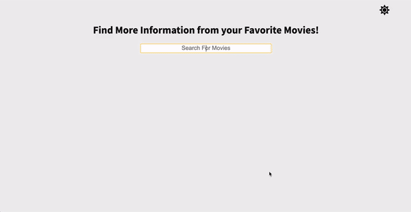

# YearOne Take Home: Movie API

View [Live Demo](https://findthemovieandlike.netlify.app)

Search through the _unofficial_ 🎥 [IMBD Movie Database](https://rapidapi.com/hmerritt/api/imdb-internet-movie-database-unofficial). Each title has its own Like to Dislike button counter so you can see if the movie was a critical hit or disliked.

## Run the Project

1. Clone project locally
2. Run `npm install` in your CLI
3. Set up `.env` file and add your own API keys
4. On root file, run `npm start` in your CLI
5. App running on `https://localhost:3000`

## Technologies

- React.js
- Firebase — Realtime Database
- SCSS
- FontAwesome
- RapidAPI — [IMBD Movie Database](https://rapidapi.com/hmerritt/api/imdb-internet-movie-database-unofficial)

## What to Improve

- I would like to use another API. The one I am currently using doesn't retrieve a good selectiong of movies based of the `userInput`. I did test it within the RapidAPI website and each search I do from my app matches what RapidAPI finds. I would use a more robust API.
